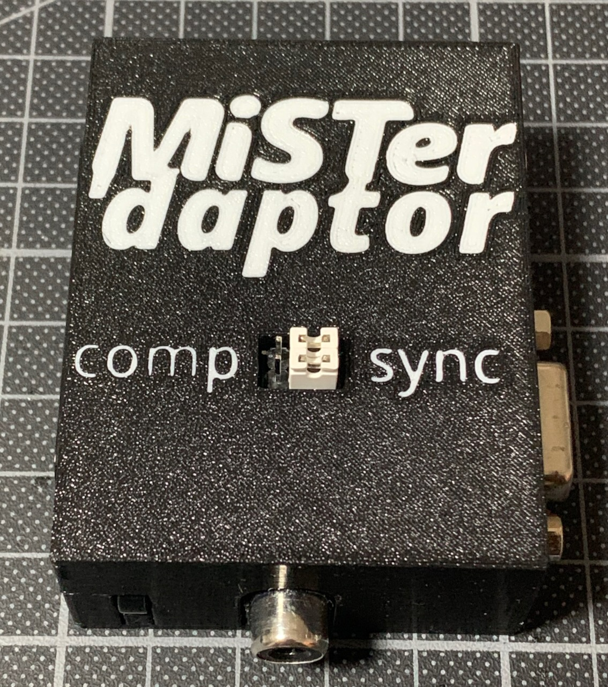

# MiSTer'dapter
A VGA and audio jack to RGB SCART converter with RCA sync or composite output for the MiSTer FPGA

    Copyright (C) 2022 Simon Kowalewski

    This program is free software; you can redistribute it and/or modify
    it under the terms of the GNU General Public License as published by
    the Free Software Foundation; either version 2 of the License, or
    (at your option) any later version.

    This program is distributed in the hope that it will be useful,
    but WITHOUT ANY WARRANTY; without even the implied warranty of
    MERCHANTABILITY or FITNESS FOR A PARTICULAR PURPOSE.  See the
    GNU General Public License for more details.

    You should have received a copy of the GNU General Public License along
    with this program; if not, write to the Free Software Foundation, Inc.,
    51 Franklin Street, Fifth Floor, Boston, MA 02110-1301 USA.

## Video demonstration
[YouTube](https://youtu.be/DpnR34e562k) (Spoken languague is German, English subtitles are available)
	
## Build yourself
You'll need the [board](board) manufactured on 1.6 mm substrate. Also, you'll need a fitting SCART, VGA, RCA and mini phone jack. (I'll add links later.) You'll also need a 470 ohm resistor for attenuating the sync signal to SCART-safe levels and, optionally but recommended, a capacitor and inductance for the luma trap. I use 33 uH and 68 pF. If you don't use C1 and L1, bridge C1 with a resistor leg.

Optionally, 3D-print the [case](case). If you can multi-color print, print case.stl and print.stl together in different colors. If you cannot, don't print print.stl. If you want to use the case, populate the jumpers on the back side of the PCB (the side without silkscreen print).

## Buy from me
I don't have a web shop right now, so just send a mail to deBaer@gmail.com and tell me how many kits you want (15 €/kit), your preferred jumper color (black, white, blue, red, green and yellow available), if I should solder and test them for you (+10 €/kit), if you want cases (+10 €/case) and your post address (postage is 2€ flat for Germany, I'll calculate the International postage on demand). I'll send you a confirmation with the expected delivery date, the final price and payment information, most likely Paypal. If you cannot or don't want to use Paypal, also indicate that in your email. Use a subject header containing "[daptor]" so I'll see the mail.

## Buy from someone else
If you offer to sell MiSTer'dapter kits, I'll list you here. Non-EU sellers are especially welcome, as I don't like customs forms. But please, attribute me and link back to this page.

## Usage
Connect the MiSTer'daptor to your MiSTer with a normal VGA cable.

### RGB SCART
Connect the MiSTer'daptor to your TV with a RGB-capable SCART cable (not all are). For audio, connect the MiSTer'daptor with a normal TRS mini jack cable to the MiSTer. Optionally, connect Guncon 2 or other controllers that need sync to the RCA jack. Use these .ini settings:

(coming soon)

### Composite
Connect the MiSTer'daptor RCA plug to a composite input (normally yellow) on the TV. Connect the MiSTer audio out directly to the TV. You need to use [Y/C-capable cores](https://github.com/MikeS11/MiSTerFPGA_YC_Encoder). Use these .ini settings:

(coming soon)